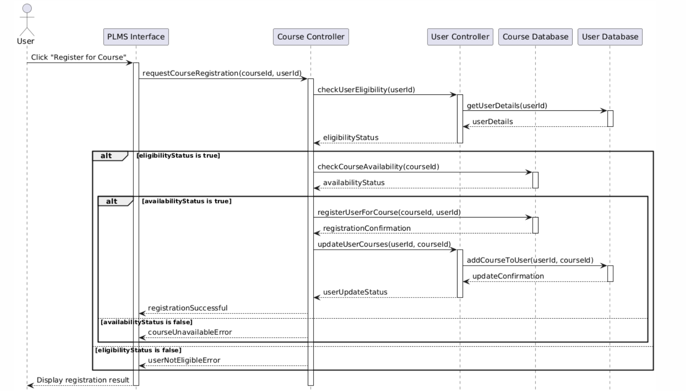
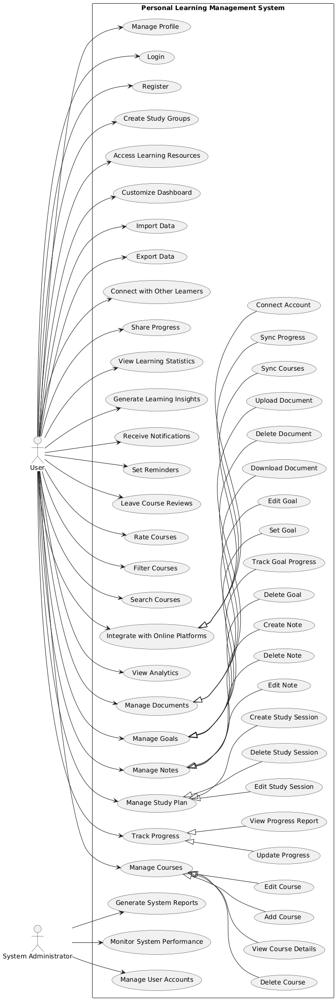

# Tài liệu Đặc tả Yêu cầu Phần mềm (SRS)

## Hệ thống Quản lý Học tập Cá nhân (PLMS)

### 1. Giới thiệu

#### 1.1 Mục đích

Tài liệu này mô tả chi tiết các yêu cầu cho Hệ thống Quản lý Học tập Cá nhân (PLMS). Nó cung cấp cho nhóm phát triển và các bên liên quan một hiểu biết chung về hệ thống, các chức năng và ràng buộc của nó.

#### 1.2 Phạm vi

PLMS là một nền tảng web cho phép người dùng quản lý và theo dõi quá trình học tập của họ trong nhiều lĩnh vực khác nhau. Hệ thống này sẽ giúp người dùng tổ chức các mục tiêu học tập, theo dõi tiến độ, và tối ưu hóa quá trình học của họ.

#### 1.3 Định nghĩa, từ viết tắt và thuật ngữ

-  PLMS: Personal Learning Management System
-  SRS: Software Requirements Specification
-  UI: User Interface
-  API: Application Programming Interface

### 2. Mô tả tổng quan

#### 2.1 Quan điểm sản phẩm

PLMS là một giải pháp toàn diện cho việc quản lý học tập cá nhân, tích hợp với các nền tảng học trực tuyến phổ biến và cung cấp các công cụ để theo dõi, phân tích và tối ưu hóa quá trình học tập.

#### 2.2 Chức năng sản phẩm

-  Quản lý khóa học
-  Theo dõi tiến độ học tập
-  Lập kế hoạch học tập
-  Quản lý ghi chú và tài liệu
-  Đặt mục tiêu và theo dõi cột mốc
-  Phân tích và báo cáo học tập
-  Tích hợp với các nền tảng học trực tuyến
-  Cộng đồng học tập

#### 2.3 Đặc điểm người dùng

-  Học sinh, sinh viên
-  Người đi làm muốn học thêm
-  Người tự học
-  Giáo viên và người hướng dẫn

#### 2.4 Ràng buộc

-  Hệ thống phải tuân thủ các quy định về bảo vệ dữ liệu cá nhân
-  Hệ thống phải hỗ trợ đa nền tảng (web, mobile)
-  Thời gian phản hồi của hệ thống không được vượt quá 2 giây

#### 2.5 Giả định và phụ thuộc

-  Người dùng có kết nối internet ổn định
-  Các nền tảng học trực tuyến đối tác duy trì API của họ

### 3. Yêu cầu cụ thể

#### 3.1 Yêu cầu giao diện người dùng

-  Giao diện trực quan, dễ sử dụng
-  Responsive design, hỗ trợ desktop và mobile
-  Hỗ trợ đa ngôn ngữ (ít nhất tiếng Anh và tiếng Việt)
-  Dark mode và light mode

#### 3.2 Yêu cầu chức năng

##### 3.2.1 Quản lý tài khoản người dùng

-  Đăng ký tài khoản mới
-  Đăng nhập/Đăng xuất
-  Quên mật khẩu
-  Cập nhật thông tin cá nhân

##### 3.2.2 Quản lý khóa học

-  Thêm khóa học mới (thủ công hoặc từ nền tảng trực tuyến)
-  Chỉnh sửa thông tin khóa học
-  Xóa khóa học
-  Phân loại khóa học theo danh mục

##### 3.2.3 Theo dõi tiến độ

-  Cập nhật tiến độ học tập cho từng khóa học
-  Hiển thị tỷ lệ hoàn thành
-  Tự động cập nhật tiến độ từ các nền tảng tích hợp

##### 3.2.4 Lập kế hoạch học tập

-  Tạo lịch học
-  Đặt nhắc nhở học tập
-  Tự động đề xuất thời gian học dựa trên lịch trình và mục tiêu

##### 3.2.5 Quản lý ghi chú và tài liệu

-  Tạo, chỉnh sửa và xóa ghi chú
-  Tải lên và quản lý tài liệu học tập
-  Tìm kiếm trong ghi chú và tài liệu

##### 3.2.6 Mục tiêu và cột mốc

-  Đặt mục tiêu học tập ngắn hạn và dài hạn
-  Tạo và theo dõi các cột mốc quan trọng
-  Nhận thông báo khi đạt được mục tiêu

##### 3.2.7 Phân tích và báo cáo

-  Tạo báo cáo tổng quan về tiến độ học tập
-  Phân tích thời gian học tập và hiệu suất
-  Đề xuất cải thiện dựa trên dữ liệu học tập

##### 3.2.8 Tích hợp nền tảng học trực tuyến

-  Kết nối với Coursera, Udemy, edX
-  Đồng bộ hóa khóa học và tiến độ
-  Xem nội dung khóa học từ các nền tảng trong PLMS

##### 3.2.9 Cộng đồng học tập

-  Tạo và tham gia nhóm học tập
-  Chia sẻ tiến độ và thành tích
-  Diễn đàn thảo luận cho từng khóa học

#### 3.3 Yêu cầu phi chức năng

##### 3.3.1 Yêu cầu hiệu suất

-  Thời gian phản hồi trung bình dưới 1 giây
-  Hỗ trợ ít nhất 10,000 người dùng đồng thời
-  Thời gian khởi động ứng dụng dưới 3 giây

##### 3.3.2 Yêu cầu bảo mật

-  Mã hóa dữ liệu người dùng
-  Xác thực hai yếu tố
-  Tuân thủ GDPR và các quy định bảo vệ dữ liệu khác

##### 3.3.3 Yêu cầu về độ tin cậy

-  Uptime 99.9%
-  Sao lưu dữ liệu hàng ngày
-  Khôi phục dữ liệu trong vòng 2 giờ sau sự cố

##### 3.3.4 Yêu cầu về khả năng mở rộng

-  Kiến trúc microservices để dễ dàng mở rộng
-  Hỗ trợ cân bằng tải tự động
-  Khả năng thêm các tính năng mới mà không ảnh hưởng đến hệ thống hiện tại

### 4. Yêu cầu hệ thống

#### 4.1 Yêu cầu phần cứng

-  Máy chủ: Tối thiểu 16GB RAM, 4 CPU cores
-  Lưu trữ: Tối thiểu 1TB SSD
-  Băng thông: Tối thiểu 1Gbps

#### 4.2 Yêu cầu phần mềm

-  Hệ điều hành: Linux (Ubuntu 20.04 LTS hoặc mới hơn)
-  Web server: Nginx
-  Database: PostgreSQL 12 trở lên
-  Backend: Node.js 14 trở lên, NestJS
-  Frontend: React 17 trở lên, Next.js
-  Containerization: Docker

### 5. Phụ lục

#### 5.1 Mô hình dữ liệu

#### 5.2 Sơ đồ use case

