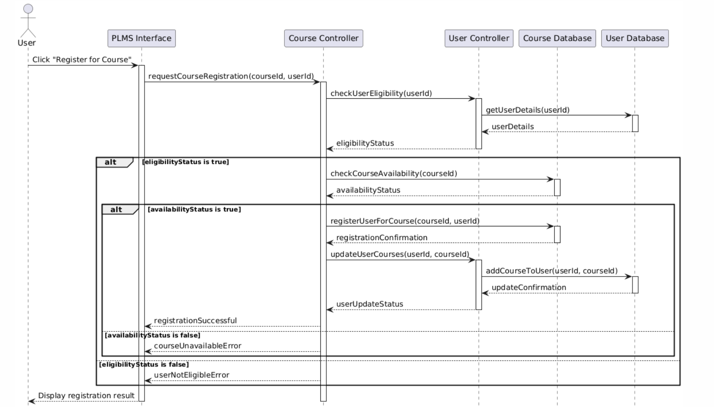

<p align="center">
  <a href="http://nestjs.com/" target="blank"></a>
</p>

[circleci-image]: https://img.shields.io/circleci/build/github/nestjs/nest/master?token=abc123def456
[circleci-url]: https://circleci.com/gh/nestjs/nest

  <p align="center">A progressive <a href="http://nodejs.org" target="_blank">Node.js</a> framework for building efficient and scalable server-side applications.</p>
    <p align="center">
<a href="https://www.npmjs.com/~nestjscore" target="_blank"></a>
<a href="https://www.npmjs.com/~nestjscore" target="_blank"></a>
<a href="https://www.npmjs.com/~nestjscore" target="_blank"></a>
<a href="https://circleci.com/gh/nestjs/nest" target="_blank"></a>
<a href="https://coveralls.io/github/nestjs/nest?branch=master" target="_blank"></a>
<a href="https://discord.gg/G7Qnnhy" target="_blank"></a>
<a href="https://opencollective.com/nest#backer" target="_blank"></a>
<a href="https://opencollective.com/nest#sponsor" target="_blank"></a>
  <a href="https://paypal.me/kamilmysliwiec" target="_blank"></a>
    <a href="https://opencollective.com/nest#sponsor"  target="_blank"></a>
  <a href="https://twitter.com/nestframework" target="_blank"></a>
</p>
  <!--[](https://opencollective.com/nest#backer)
  [](https://opencollective.com/nest#sponsor)-->

## Description
---
title: Personal Learning Management System (PLMS)
excerpt: A comprehensive system for managing personal learning journeys
---

# Personal Learning Management System (PLMS)

## Introduction

The Personal Learning Management System (PLMS) is a robust platform designed to help individuals manage their learning journey effectively. It provides a suite of tools for course management, progress tracking, goal setting, and more.

## Features

-  User Registration and Authentication
-  Course Management
-  Progress Tracking
-  Study Plan Creation
-  Note-taking
-  Goal Setting and Tracking
-  Document Management
-  Analytics and Insights
-  Integration with Online Learning Platforms

## Getting Started

### Prerequisites

-  Node.js (v14.0.0 or later)
-  MongoDB (v4.4 or later)
-  npm (v6.0.0 or later)

### Installation

1. Clone the repository:

`git clone https://github.com/LeVSon1507/plms.git`

2. Navigate to the project directory:
   `cd plms`

3. Install dependencies:
   `npm install`

4. Set up environment variables:
   Create a `.env` file in the root directory and add the following:

````PORT=3000
    JWT_SECRET=your_jwt_secret```

5. Start the server:
   `npm star`

## API Documentation

For detailed API documentation, please refer to our [API Guide](to-be-define).

## Use Cases

Our system supports a wide range of use cases. For a comprehensive list, check out our [Use Case Diagram].

## Sequence Diagrams

For insights into how our system handles various processes, take a look at our [Sequence Diagrams].

## License

This project is licensed under the MIT License - see the [LICENSE.md](LICENSE) file for details.
````
